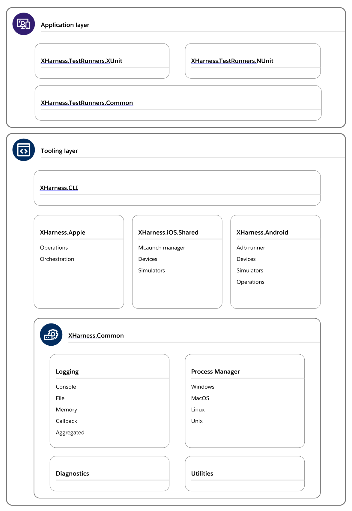

# Overview

This document provides a high-level overview of the XHarness architecture, which is organized into two main layers: the tooling layer and the application layer.

## Tooling layer

The tooling layer represents the foundation of the tool.

**XHarness.CLI** is the CLI that defines commands and arguments for interacting with XHarness. It serves as the main entry point for users.

**XHarness.Android** and **XHarness.Apple** implement platform-specific operations and their orchestration. On Android, it uses `adb` runner for communication with devices and command execution. For Apple mobile platforms, it relies on `mlaunch` manager to interact with simulators and devices.

**XHarness.iOS.Shared** is specific to Apple mobile platforms, managing functionalities such as AppBundle information, simulators, and device configurations.

**XHarness.Common** provides the essential building blocks, including logging, execution, utilities, and diagnostics. Logging supports various formats, such as `ConsoleLogger`, `FileLogger`, `MemoryLogger`, `AggregatedLogs`, and `CallbackLogger`. The execution component implements platform-specific command runners. Utilities contain helper functions used across the tool. Diagnostics provide detailed information about the execution environment.

Logging is enabled by default, with the console logger being the default for commands. The file logger is used for `mlaunch` and `adb` commands. The memory logger is used by the platform-specific command runners.

## Application layer

The application layer manages test execution, discovery, and results aggregation.

**XHarness.TestRunners.XUnit** and **XHarness.TestRunners.NUnit** are framework-specific components designed to run tests using these frameworks.

**XHarness.TestRunners.Common** implements the tests discovery, execution, and results aggregation.

